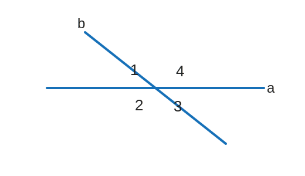

# Y7M-WRONG-001 第 6 题：旋转相交线后的角度变化

原图：`Y7M-WRONG-001.jpg`

附件：`Y7M-WRONG-001-第6题-figure.svg`

## 题目

如图，取两根木条 $a,b$，将它们钉在一起，得到一个相交线的模型。固定木条 $a$，转动木条 $b$，当 $\angle 1$ 增大 $4^\circ$ 时，下列说法正确的是（ ）。

A. $\angle 2$ 增大 $4^\circ$

B. $\angle 3$ 增大 $4^\circ$

C. $\angle 4$ 增大 $4^\circ$

D. $\angle 4$ 减小 $2^\circ$

## 整理

（待整理）
