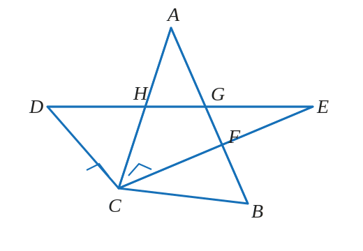

# Y7M-WRONG-001 第 7 题：两块三角尺的角相等

原图：`Y7M-WRONG-001.jpg`

附件：`Y7M-WRONG-001-第7题-figure.svg`

## 题目

如图，将两块三角尺的直角顶点重合，各边的交点分别为 $F,G,H$。

请将下表补充完整，并思考：这些角相等的理由都一样吗？

| 序号 | ① | ② | ③ | ④ | ⑤ |
|---|---|---|---|---|---|
| 角 | $\angle AHD$ | $\angle AGD$ | $\angle BFC$ | $\angle AGE$ | $\angle DCA$ |
| 相等的角（写出一个即可） | $\angle CHE$ | $\angle EGF$ | $\angle EFG$ | $\angle BGD$ | $\angle BCE$ |

## 整理

（待整理）
