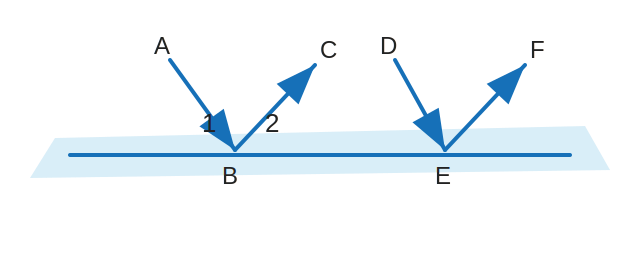

# Y7M-WRONG-002 第 8 题：反射光线中的同位角和同旁内角

原图：`Y7M-WRONG-002.jpg`

附件：`Y7M-WRONG-002-第8题-figure.svg`

## 题目

如图，两条光线 $AB$ 与 $DE$ 射向一个水平镜面后被反射。

1. 写出 $\angle 1$ 的同位角、$\angle 2$ 的同旁内角。
2. 图中有 $\angle 2$ 的内错角吗？

## 整理

（待整理）
