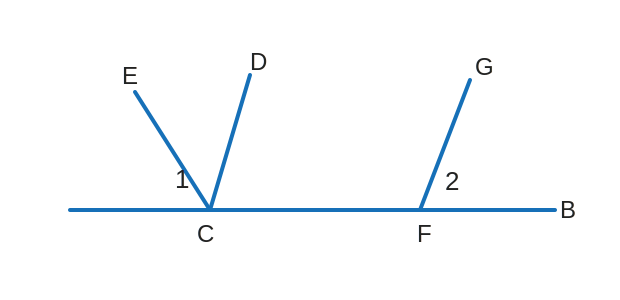

# Y7M-WRONG-003 第 4 题：角平分线与平行线判定

原图：`Y7M-WRONG-003.jpg`

附件：`Y7M-WRONG-003-第4题-figure.svg`

## 题目

如图，已知 $\angle 1=50^\circ$，$\angle 2=65^\circ$，$CD$ 平分 $\angle ECF$，请说明理由：$CD \parallel FG$。

## 整理

（待整理）
