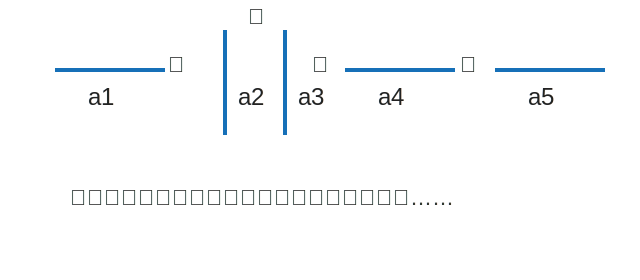

# Y7M-WRONG-004 第 7 题：多条直线的位置关系规律

原图：`Y7M-WRONG-004.jpg`

附件：`Y7M-WRONG-004-第7题-figure.svg`

## 题目

现有 $100$ 条直线 $a_1,a_2,a_3,\ldots,a_{100}$，且有

$$
a_1\perp a_2,\quad a_2\parallel a_3,\quad a_3\perp a_4,\quad a_4\parallel a_5,\ldots
$$

1. 试判断直线 $a_1$ 与 $a_4$ 的位置关系，并说明理由。
2. 直线 $a_1$ 与 $a_{99}$ 的位置关系是？

## 整理

（待整理）
